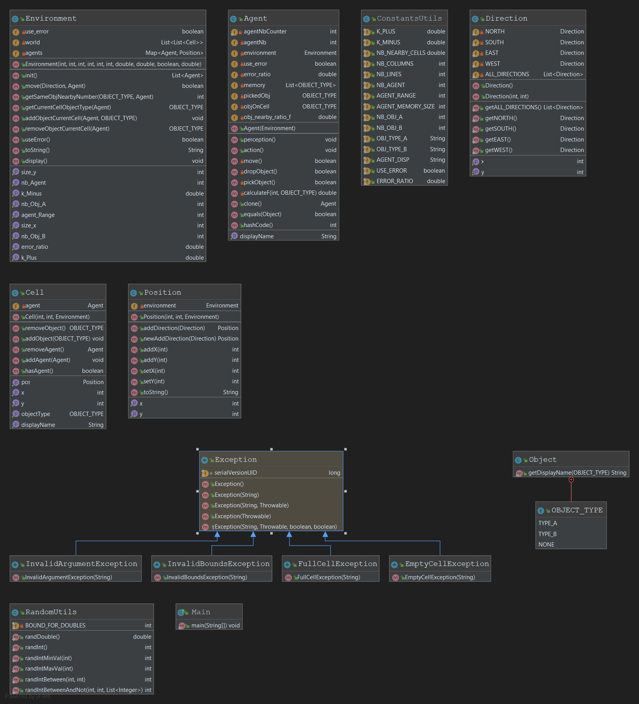
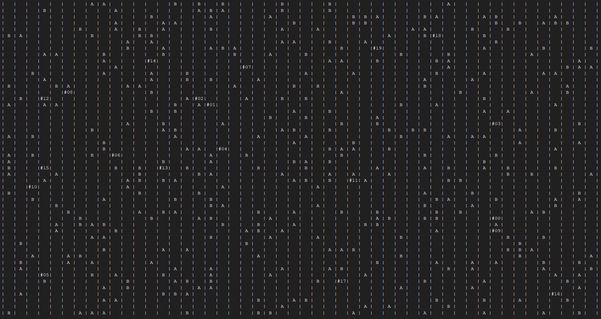
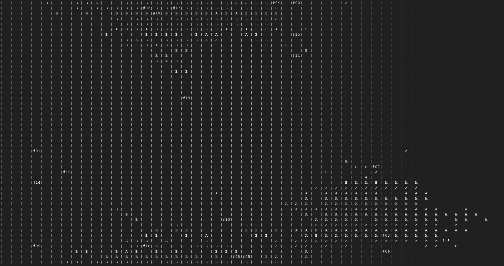

### Introduction

Dans le cadre de notre cours sur les Systèmes Multi-Agents, nous avons eu l’occasion de programmer un projet de tri collectif multi-agents. Le principe est assez simple : l’Environnement contient un monde sous forme de grille (50x50), sur laquelle sont disposés 400 Objets de deux types (répartition égale, 200 Objets de type A et 200 de type B), de manière aléatoire. Nos Agents sont placés eux-aussi aléatoirement sur ce monde, et ont pour objectif de trier les Objets s’y trouvant, en créant idéalement deux clusters, un pour les Objets A et un pour les Objets B.

### Implémentation

Le diagramme de classes est présenté ci-dessous

### Exemples d'exécution

Voici un exemple d'exécution avec le mode Mémoire et Biais de reconnaissance d'Objets activé :

Environnement initial :

Environnement final :

